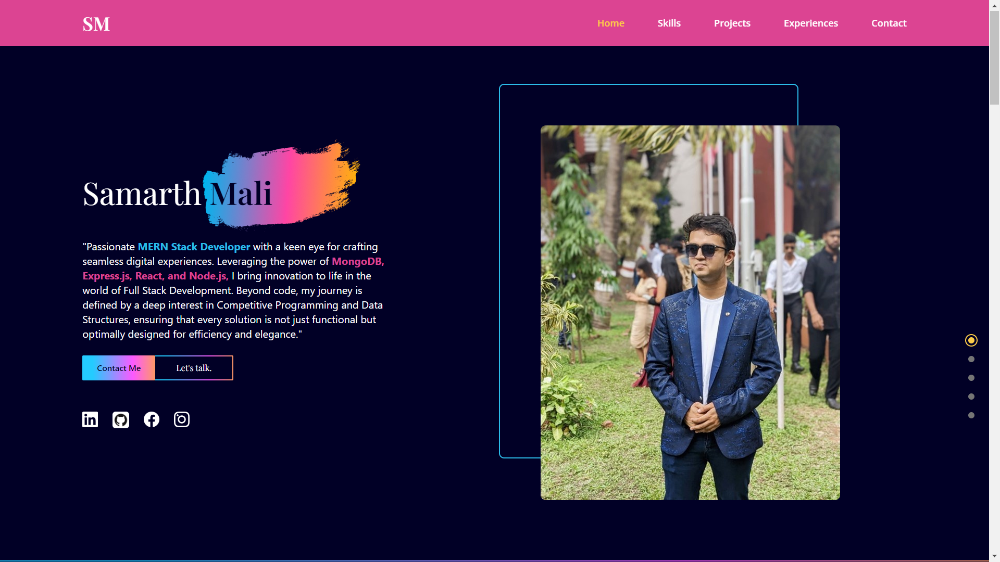
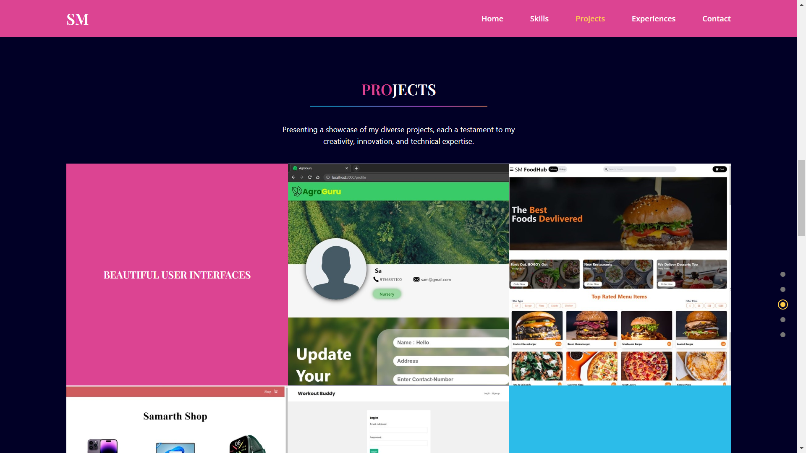

# My Portfolio 🌟

Welcome to my portfolio! This project is a personal website built using React to showcase my projects, skills, and experiences.

## Table of Contents
- [Introduction](#introduction)
- [Features](#features)
- [Demo](#demo)
- [Screenshots](#screenshots)
- [License](#license)
- [Contact](#contact)

## Introduction

This portfolio serves as a central hub for all my professional information, projects, and contact details. It is built using React, offering a dynamic and responsive user experience.

## Features

- **Responsive Design:** Adapts to various screen sizes for an optimal viewing experience.
- **Dynamic Content:** Easily update and manage projects and skills through a JSON file or API.
- **Interactive UI:** Smooth animations and transitions for a modern look and feel.
- **Contact Form:** Integrated contact form to receive messages directly.

## Demo

Check out the live demo of my portfolio [here](https://sm-portfolio-jet.vercel.app).

## Screenshots

Here are some screenshots of my portfolio:

*Home Page*

*Projects Page*

## License

This project is licensed under the MIT License. See the [LICENSE](LICENSE) file for more details.

## Contact

Feel free to reach out to me for any questions or suggestions:

- **Email:** [samarthmali1100@gmail.com](mailto:samarthmali1100@gmail.com)
- **LinkedIn:** [My LinkedIn](https://www.linkedin.com/in/samarth-mali-19ab15225/)
- **GitHub:** [My Github](https://github.com/samarthsm1100)
